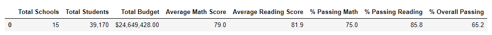

# School_District_Analysis

## Table of Contents
* [Project title](#project-title)
* [Technologies](#technologies)
* [Overview](#overview)
* [Analysis](#analysis)

## Project title
School District Analysis - Module 4 Challenge 

## Technologies
[Python](https://www.python.org/downloads/ "Download Python") 3.7.9.

## Overview 
Using Pandas and Python to explore the given datasets: 1) [schools_complete.csv](https://github.com/Bominkkwon/School_District_Analysis/tree/main/Resources "Resources/schools_complete.csv"), which consists of school ID, school name, school type, size, and budget and 2) [students_complete.csv](https://github.com/Bominkkwon/School_District_Analysis/tree/main/Resources "Resources/students_complete.csv"), which consists of student ID, student name, gender, grade, school name, reading score, and math score. The results from the module give the following list of deliverables for the analysis of the school district:

* A high-level snapshot of the district's key metrics, presented in a table format
* An overview of the key metrics for each school, presented in a table format
* Tables presenting each of the following metrics:
* Top 5 and bottom 5 performing schools, based on the overall passing rate
* The average math score received by students in each grade level at each school
* The average reading score received by students in each grade level at each school
* School performance based on the budget per student
* School performance based on the school size 
* School performance based on the type of school

Then the module provided additional information for the Module 4 challenge-- "students_complete.csv file shows evidence of academic dishonesty; specifically, reading and math grades for Thomas High School ninth graders appear to have been altered" and was asked replace the math and reading scores for Thomas High School with NaNs while keeping the rest of the data intact. By repeating the school district analysis for this module after making these changes ([PyCitySchools_Challenge](https://github.com/Bominkkwon/School_District_Analysis/blob/main/PyCitySchools_Challenge.ipynb)), it allows us to analyze how these changes affected the overall analysis.

## Analysis

* How is the district summary affected?

(District summary with the original dataset)

(District summary after making the "NaN" changes)

The passing math % has decreased by .2%-- one can conclude that some of Thomas High School 9th graders who were removed has passing math score.

* How is the school summary affected?

(School summary with the original dataset)

(School summary after making the "NaN" changes)

As the average math and reading score decreases, the passing % for both sujects and the overall % have decreased as well.  

* How does replacing the ninth graders’ math and reading scores affect Thomas High School’s performance relative to the other schools?
Since such changes did not make a huge difference for Thomas High School's overall passing %, Thomas High School’s performance relative to the other schools did not change drastically. Therefore, Thomas High School still remains in the top 5 school list.

* How does replacing the ninth-grade scores affect the following:
* Math and reading scores by grade
The only change here is that the THS 9th graders' reading and math scores are showing as "NaN"

