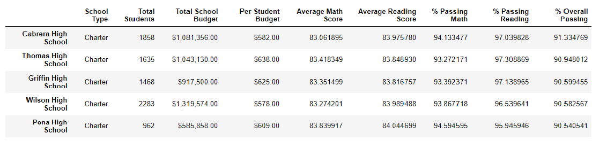

# School_District_Analysis


## Table of Contents
* [Project title](#project-title)
* [Technologies](#technologies)
* [Overview](#overview)
* [Analysis](#analysis)


## Project title
School District Analysis - Module 4 Challenge 

## Technologies
[Python](https://www.python.org/downloads/ "Download Python") 3.7.9.

## Overview 
Using Pandas and Python to explore the given datasets: 1) [schools_complete.csv](https://github.com/Bominkkwon/School_District_Analysis/tree/main/Resources "Resources/schools_complete.csv"), which consists of school ID, school name, school type, size, and budget and 2) [students_complete.csv](https://github.com/Bominkkwon/School_District_Analysis/tree/main/Resources "Resources/students_complete.csv"), which consists of student ID, student name, gender, grade, school name, reading score, and math score. The results from the module give the following list of deliverables for the analysis of the school district:

* A high-level snapshot of the district's key metrics, presented in a table format
* An overview of the key metrics for each school, presented in a table format
* Tables presenting each of the following metrics:
* Top 5 and bottom 5 performing schools, based on the overall passing rate
* The average math score received by students in each grade level at each school
* The average reading score received by students in each grade level at each school
* School performance based on the budget per student
* School performance based on the school size 
* School performance based on the type of school

Then the module provided additional information for the Module 4 challenge-- "students_complete.csv file shows evidence of academic dishonesty; specifically, reading and math grades for Thomas High School ninth graders appear to have been altered" and was asked replace the math and reading scores for Thomas High School with NaNs while keeping the rest of the data intact. 

To replace the math and reading scores for Thomas High School with NaNs:
```python

student_data_df.loc[(student_data_df["school_name"] == "Thomas High School") & (student_data_df["grade"] == "9th"), "reading_score"] = np.nan

student_data_df.loc[(student_data_df["school_name"] == "Thomas High School") & (student_data_df["grade"] == "9th"), "math_score"] = np.nan

```
By repeating the school district analysis for this module after making these changes ([PyCitySchools_Challenge](https://github.com/Bominkkwon/School_District_Analysis/blob/main/PyCitySchools_Challenge.ipynb)), it allows us to analyze how these changes affected the overall analysis.

## Analysis


* How is the district summary affected?


(District summary with the original dataset)

(District summary after making the "NaN" changes)

The "Average Math Score" decreased by .1 and the "Passing Math %" deceased by .2%-- and due decreased in these two, the "Overall Passing %" decreased by .3%. One can conclude that some of the math scores of the Thomas High School 9th graders that were removed was considered "passing score," which is >= 70%. Even though the "Average Reading score" did not change, the "Passing Reading %" has decreased by .1%. One can predict that this minor change has occurred due to the removal of the Thomas High School 9th grader(s) who had the "reading score" equals to the "Average Reading Score" in the district summary.

* How is the school summary affected?


(School summary with the original dataset)

(School summary after making the "NaN" changes)

The "Average Math Score" decreased by .06 and the "Passing Math %" decreased by .09%. The "Average Reading score" increased by .05 and the "Passing Reading %" decreased by .29% and the "Overall Passing %" decreased by .31%. One can conclude that some of the math scores of the Thomas High School 9th graders were a little higher than other Thomas High Schoolstudents' math scores and some of the reading scores of the Thomas High School 9th graders were a little lower than other Thomas High School students' reading scores.

* How does replacing the ninth graders’ math and reading scores affect Thomas High School’s performance relative to the other schools?



(School "rankings" with the original dataset)

(School "rankings" after making the "NaN" changes)

Since such changes did not make a huge difference for Thomas High School's overall passing %, Thomas High School’s performance relative to the other schools did not change drastically. Therefore, Thomas High School still remains in the top 5 school list.

* How does replacing the ninth-grade scores affect the following:
* Math and reading scores by grade

The only change here is that the Thomas High School 9th graders' reading and math scores are showing as "NaN."

* Scores by school spending

Replacing the ninth-grade scores  does not affect the "Scores by school spending" summary.

* Scores by school size

Replacing the ninth-grade scores does not affect the "Scores by school size" summary.
* Scores by school type

Replacing the ninth-grade scores does not affect the "Scores by school type" summary.


In conclusion, there were some major changes occurred after after reading and math scores have been replaced. The "school summary" for Thomas High School had multiple changes: decrease in "Average Math Score", "Passing Math %", "Passing Reading %", and "Overall Passing %." Since Thomas High School's "Overall Passing %" has decreased, it lowered the "Overall Passing %" of the whole district. From a micro perspective("School summary"), such eliminations made a "large" decrease and increase in the numbers, but from a macro perspective("District summary"), the eliminations did not made a huge difference. 
